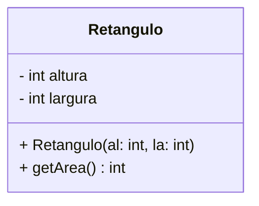
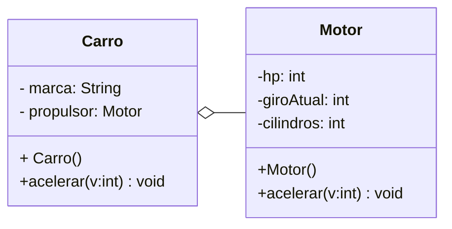
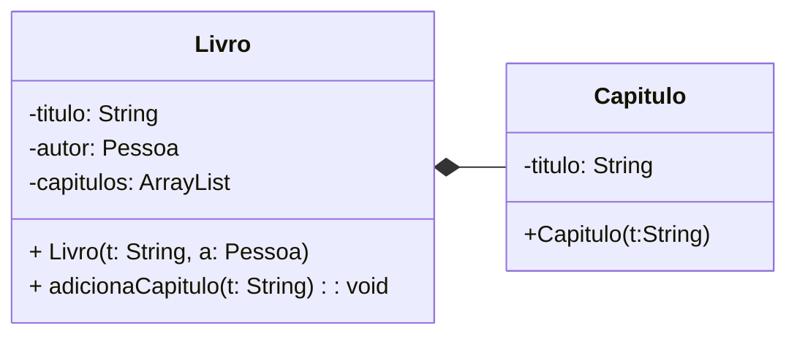
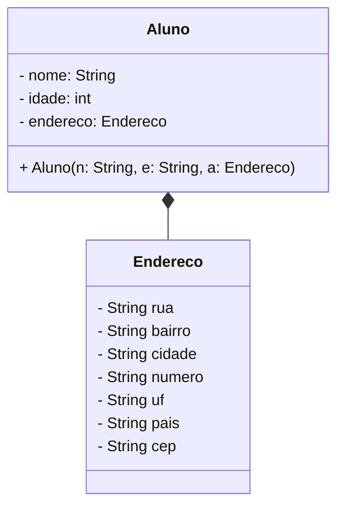
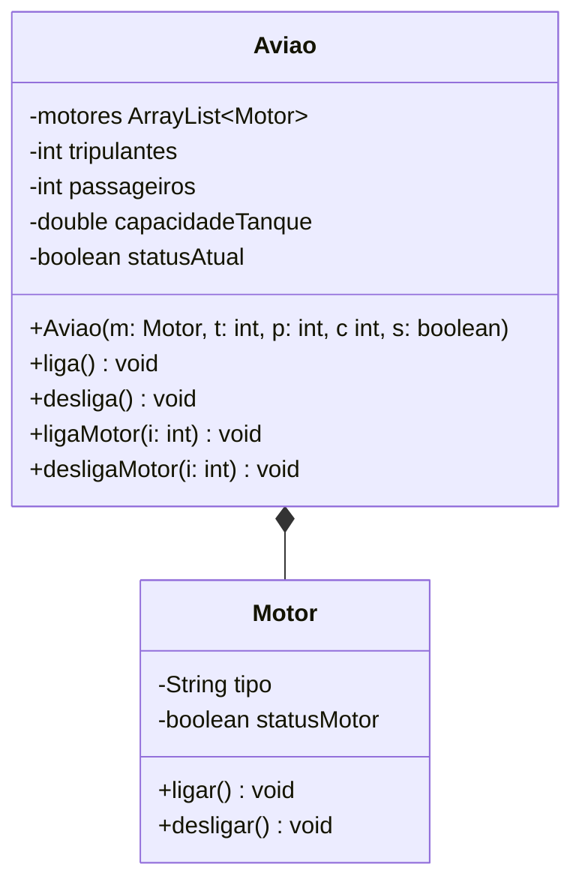

# Diagrama de classes UML

```java
public class pessoa{
    private string nome;
}
```


## Diagrama UML



```mermaid
    classDiagram
        class Retangulo{
            - int altura
            - int largura
            + Retangulo(al: int, la: int)
            + getArea() int
        }

```
# Associação entre Classes


```mermaid
classDiagram
    direction LR
    class Carro{
    - marca: String
    - propulsor: Motor
    + Carro()
    +acelerar(v:int)void 
    }
 
 class Motor{
        -hp: int
        -giroAtual: int
        -cilindros: int
        +Motor()
        +acelerar(v:int)void
    }
    Carro o-- Motor
    
    
```
# Associação do tipo Composição

```mermaid
    classDiagram
        direction LR
        class Livro{
        -titulo: String
        -autor: Pessoa
        -capitulos: ArrayList<Capitulo>
        + Livro(t: String, a: Pessoa)
        + adicionaCapitulo(t: String): void
        }
        class Capitulo{
        -titulo: String
        +Capitulo(t:String)
        }
        Livro *-- Capitulo
```


```mermaid
    classDiagram
        class Aluno{
            - nome: String
            - idade: int
            - endereco: Endereco
            + Aluno(n: String, e: String, a: Endereco)
        }
        class Endereco{
            - String rua
            - String bairro
            - String cidade
            - String numero
            - String uf
            - String pais 
            - String cep
        }
        Aluno *-- Endereco
```


```mermaid
    classDiagram
        class Aviao{
            -motores ArrayList~Motor~
            -int tripulantes
            -int passageiros
            -double capacidadeTanque
            -boolean statusAtual
            +Aviao(m: Motor, t: int, p: int, c int, s: boolean)
            +liga() void
            +desliga() void
            +ligaMotor(i: int) void
            +desligaMotor(i: int) void
        }
        class Motor{
            -String tipo
            -boolean statusMotor
            +ligar() void
            +desligar() void
        }
        
        
        Aviao *-- Motor
```