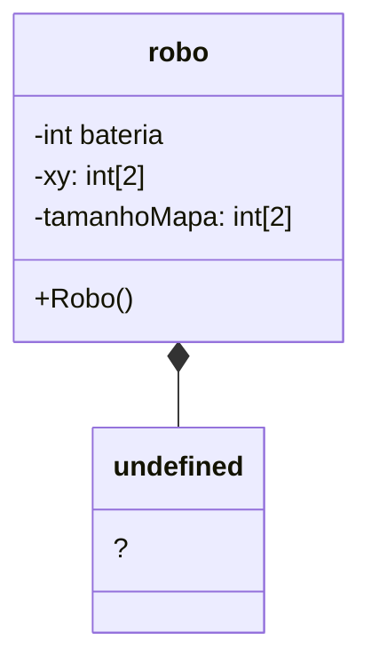

# Diagrama Robo

```mermaid
classDiagram
    class robo{
        -int bateria
        -xy: int[2]
        -tamanhoMapa: int[2]
        +Robo()
    }
    class undefined{
        ?
    }
    robo *-- undefined
```