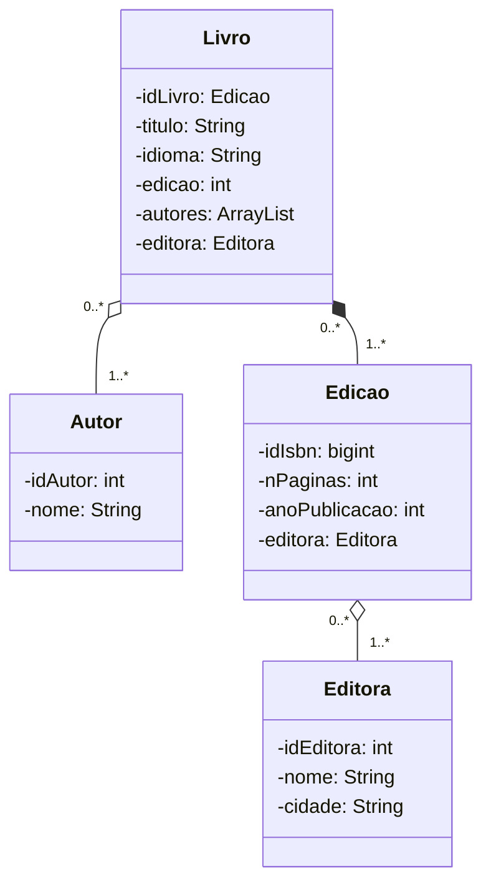
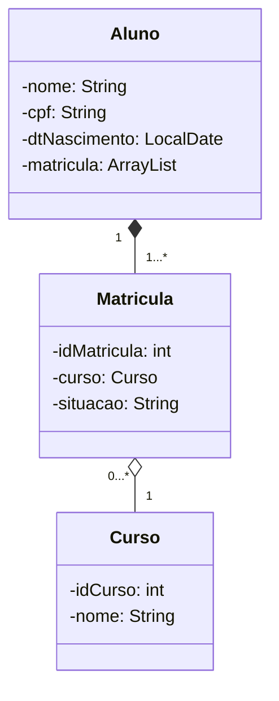
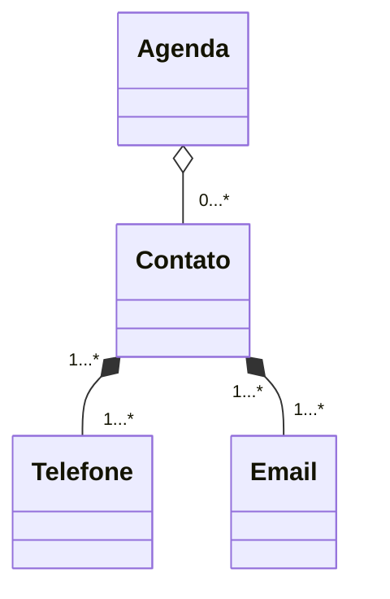

```mermaid
classDiagram
    class Livro{
        -idLivro: Edicao
        -titulo: String
        -idioma: String
        -edicao: int
        -autores: ArrayList<Autor>
        -editora: Editora
    }
    class Editora{
        -idEditora: int
        -nome: String
        -cidade: String
    }
    class Autor{
        -idAutor: int
        -nome: String
    }
    class Edicao{
        -idIsbn: bigint
        -nPaginas: int
        -anoPublicacao: int
        -editora: Editora
    }
    Livro "0..*" o-- "1..*" Autor
    Livro "0..*" *-- "1..*" Edicao
    Edicao "0..*" o-- "1..*" Editora
```

```mermaid
classDiagram
    class Aluno{
        -nome: String
        -cpf: String
        -dtNascimento: LocalDate
        -matricula: ArrayList<Matricula>
 }
    class Curso{
        -idCurso: int
        -nome: String
    }
    class Matricula{
        -idMatricula: int
        -curso: Curso
        -situacao: String
    }
    Aluno "1" *-- "1...*" Matricula
    Matricula "0...*" o-- "1" Curso

```

```mermaid
classDiagram
    class Agenda{
    }
    class Contato{
    }
    class Telefone{
    }
    class Email{
    }
    
    Agenda  o-- "0...*" Contato
    Contato "1...*" *-- "1...*" Telefone
    Contato "1...*" *-- "1...*" Email
```