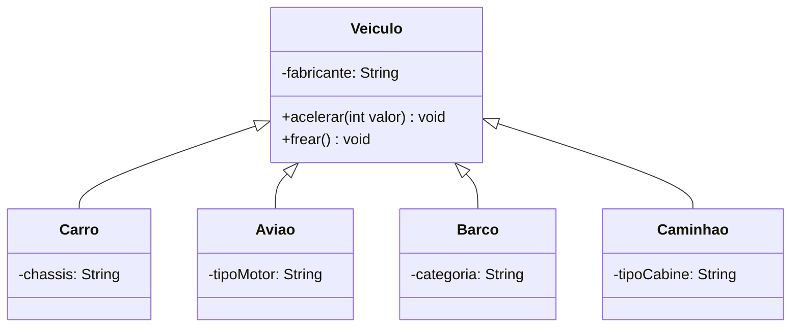

```mermaid
    classDiagram
        class Veiculo{
            -fabricante: String
            +acelerar(int valor) void
            +frear() void
        }
        class Carro{
            -chassis: String
        }
        class Aviao{
            -tipoMotor: String
        }
        class  Barco{
            -categoria: String
        }
        class Caminhao{
            -tipoCabine: String
        }
    Veiculo<|-- Carro
    Veiculo<|-- Aviao
    Veiculo<|-- Barco
    Veiculo<|-- Caminhao
```

