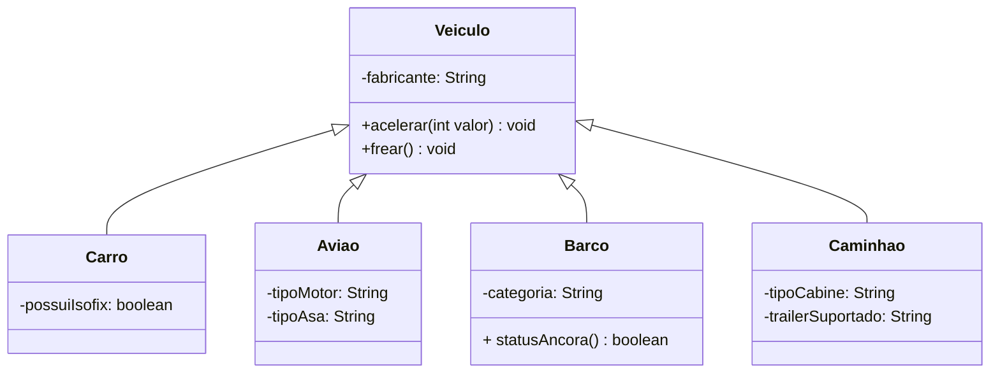
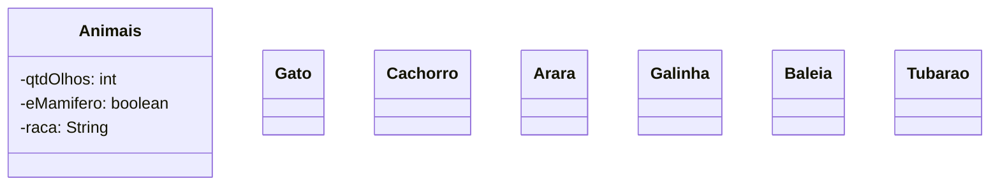

```mermaid
    classDiagram
        class Veiculo{
            -fabricante: String
            +acelerar(int valor) void
            +frear() void
        }
        class Carro{
            -possuiIsofix: boolean
        }
        class Aviao{
            -tipoMotor: String
            -tipoAsa: String
        }
        class  Barco{
            -categoria: String
            + statusAncora() boolean
        }
        class Caminhao{
            -tipoCabine: String
            -trailerSuportado: String
        }
    Veiculo<|-- Carro
    Veiculo<|-- Aviao
    Veiculo<|-- Barco
    Veiculo<|-- Caminhao
```

```mermaid
    classDiagram
        class Animais{
            -qtdOlhos: int
            -eMamifero: boolean
            -raca: String
        }
        class Gato{
            
        }
        class Cachorro{
            
        }
        class Arara{
            
        }     
        class Galinha{
            
        }
        class Baleia{
            
        }
        class Tubarao{
            
        }
```