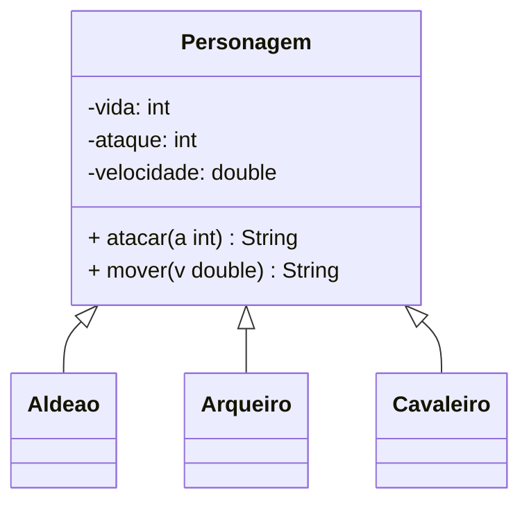

```mermaid
    classDiagram
        class Personagem{
            -vida: int
            -ataque: int
            -velocidade: double
            + atacar(a int) String
            + mover(v double) String
        }
        class Aldeao{
            
        }
        class Arqueiro{
            
        }
        class Cavaleiro{
            
        }
        Personagem <|-- Aldeao
        Personagem <|-- Arqueiro
        Personagem<|-- Cavaleiro
```