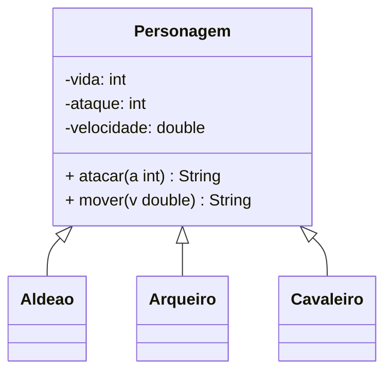
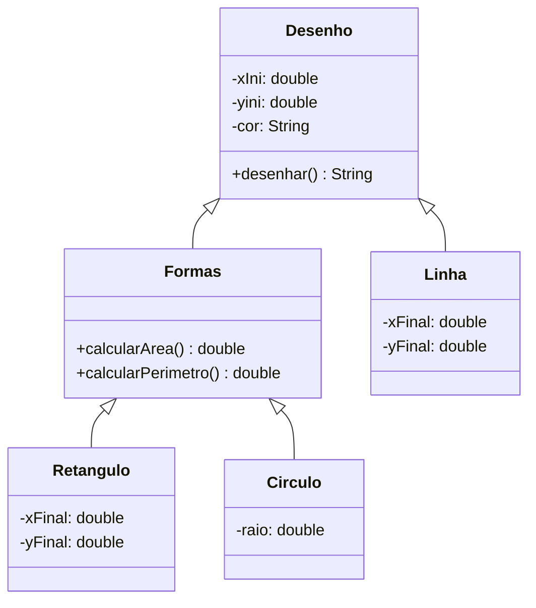

```mermaid
    classDiagram
        class Personagem{
            -vida: int
            -ataque: int
            -velocidade: double
            + atacar(a int) String
            + mover(v double) String
        }
        class Aldeao{
            
        }
        class Arqueiro{
            
        }
        class Cavaleiro{
            
        }
        Personagem <|-- Aldeao
        Personagem <|-- Arqueiro
        Personagem<|-- Cavaleiro
```

```mermaid
    classDiagram
        class Desenho{
            -xIni: double
            -yini: double
            -cor: String
            +desenhar()String
        }
        class Formas{
            +calcularArea()double
            +calcularPerimetro()double
        }
        class Linha{
            -xFinal: double
            -yFinal: double
        }
        class Retangulo{
            -xFinal: double
            -yFinal: double
        }
        class Circulo{
            -raio: double
        }
        
        
        Desenho <|-- Formas
        Formas<|--Retangulo
        Desenho <|-- Linha
        Formas <|-- Circulo
```