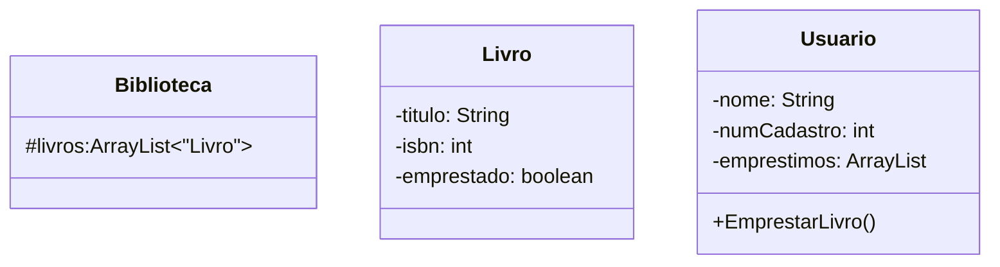

```mermaid
    classDiagram
        class Biblioteca{
            #livros:ArrayList<"Livro">
        }
        class Livro{
            -titulo: String
            -isbn: int
            -emprestado: boolean
        }
        class Usuario{
            -nome: String
            -numCadastro: int
            -emprestimos: ArrayList<Livro>
            +EmprestarLivro()
        }

```